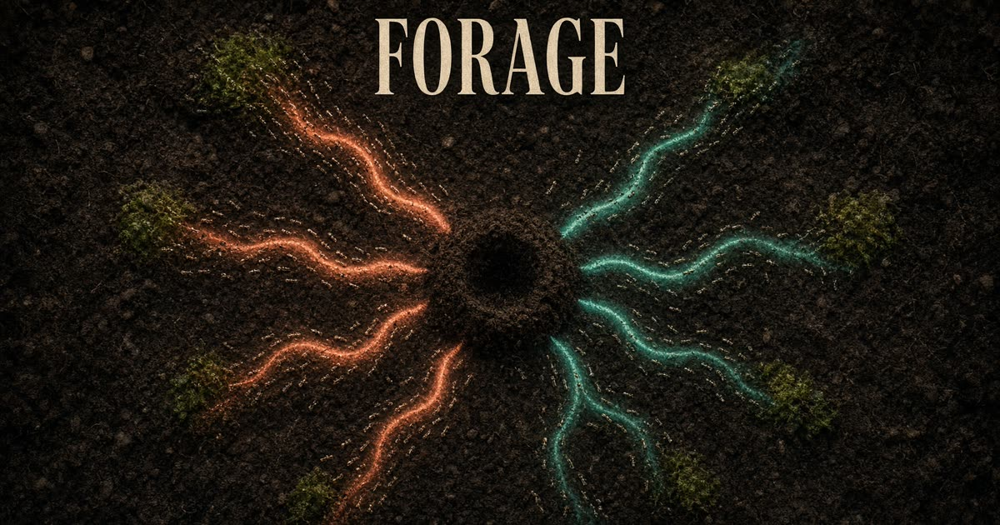

# Forage

A real-time ant colony simulator you can play in the browser.

Inspired by [Pezzza's Work](https://www.youtube.com/@PezzzasWork) and the public MIT-licensed [johnBuffer/AntSimulator](https://github.com/johnBuffer/AntSimulator). This is an original TypeScript rewrite — not a port of Ant Simulator 2 (those sources live on Patreon).

## Play

- **Food** (F) — paint a food pile
- **Wall** (W) — block a path
- **Erase** (E) — cut a door through a wall
- **Nest** (N) — plant another colony
- **Pan** (H) / middle-drag / right-drag — move the view
- Scroll to zoom
- **P** pause · **M** trails · **A** ants · **S** speed · **R** reset

Four maps: open field, maze, two colonies, chambers.

## How the colony thinks

Each ant is a tiny agent with two jobs: find food, or carry it home.

1. Walking out, it drops a **to-home** scent that fades with time.
2. Walking back with food, it drops a **to-food** scent.
3. Every fraction of a second it samples a cone ahead (~28 random probes) and steers toward the strongest matching trail it can see without walking through a wall.
4. When the last crumb of a pile is taken, a **repellent** is left so the next wave stops mining an empty patch.
5. Shorter routes get walked more often, so they stay louder as longer ones evaporate. A path appears.

That is the same idea Pezzza popularized: no central planner, just markers and many bodies.

## Develop

The simulation lives in `src/sim/`:

| File | Role |
| --- | --- |
| `simulation.ts` | Ant SoA, steering, markers, colony growth |
| `world.ts` | Grid: walls, food, pheromones, nest masks |
| `renderer.ts` | Canvas: trails, dirt, ants, nests |
| `scenarios.ts` | Starting maps |
| `constants.ts` | Speeds, intensities, colors |

Tweak `MARKER_INTENSITY`, `DETECT_DIST`, and `SAMPLE_COUNT` first if you want different trail behavior.

## Credit

- [Pezzza's Work](https://www.youtube.com/@PezzzasWork) — the videos that made this genre sing
- [johnBuffer/AntSimulator](https://github.com/johnBuffer/AntSimulator) — MIT, C++/SFML original
- [Sebastian Lague](https://github.com/SebLague/Ant-Simulation) — Unity take, also after Pezzza

## License

MIT. See [LICENSE](LICENSE).
